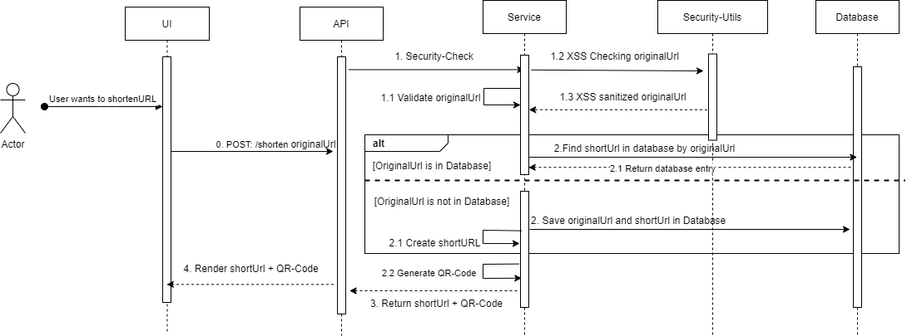

## Little URL-Shortener with QR-Code generator

With this small Laravel app, you can shorten links and it also generates a QR code. 
Everything was implemented with Docker Compose.

## Getting started (with Docker Compose)
To build the application with Docker Compose, the following commands must be executed:

1) Build the image, start the container: `docker compose up -d --build`

2) Install PHP-dependencies: `docker compose exec app composer install`

3) Generate an application key: `docker compose exec app php artisan key:generate`

4) Execute database migration: `docker compose exec app php artisan migrate`

#### ------------- For Vite ------------
5) Execute npm install (as root): `docker compose exec --user root app npm install`

6) Execute npm run dev (as root): `docker compose exec --user root app npm run dev`
#### -----------------------------------

7) Open `http://localhost:8000` in your browser.

## Getting started (without Docker)
To build the application without Docker, the following commands must be executed:
1) You need to install PHP 8.3 and Composer.

2) A Database (e.g. MySQL, PostgreSQL or SQLite)

3) Install PHP-dependencies: `composer install`

4) Generate an application key: `php artisan key:generate`

5) Execute database migration: `php artisan migrate`
#### ------------- For Vite ------------
6) Execute npm install: `npm install`

7) Execute npm run build: `npm run buid`
#### -----------------------------------

8) Start the server: `php artisan serve`

9) Open `http://localhost:8000` in your browser. 

## Sequence diagram

